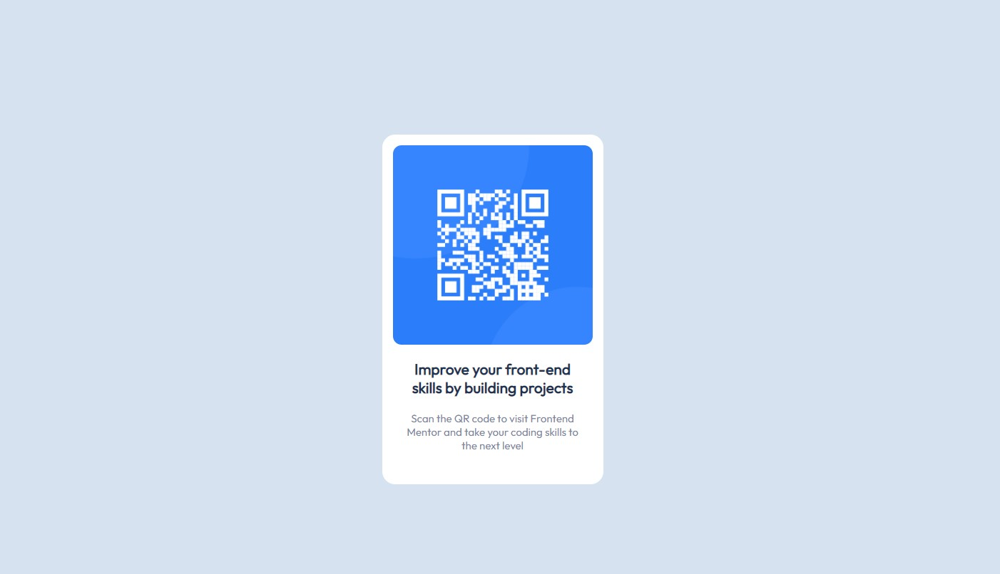

# Frontend Mentor - QR code component solution

This is a solution to the [QR code component challenge on Frontend Mentor](https://www.frontendmentor.io/challenges/qr-code-component-iux_sIO_H). 

## Table of contents

- [Overview](#overview)
  - [Screenshot](#screenshot)
  - [Links](#links)
- [My process](#my-process)
  - [Built with](#built-with)
  - [What I learned](#what-i-learned)

**Note: Delete this note and update the table of contents based on what sections you keep.**

## Overview
- A simple QR Code card that is centered in the middle of all screen types.

### Screenshot

### Links

- Live Site URL: [Live](https://daveaigbe.github.io/QR-Code/)

### My process

- My first step was to get down the colors and put them on the screen first.
- Next I edited the font and font weights
- Then I created the card with proper padding and centering.
- Last I centered the card inside of its flex container(window)

### Built with

- Semantic HTML5 markup
- CSS custom properties
- Flexbox
- Mobile-first workflow

### What I learned

I cleared up some misconceptions I had about flexbox and how to use it. Also increased my attention to detail.
